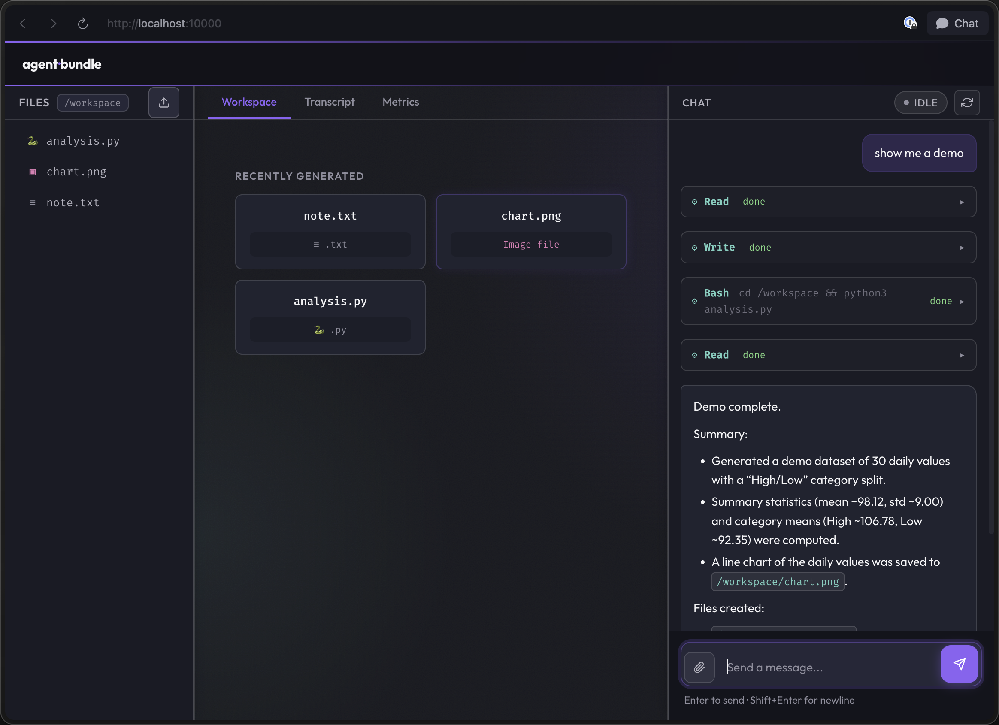
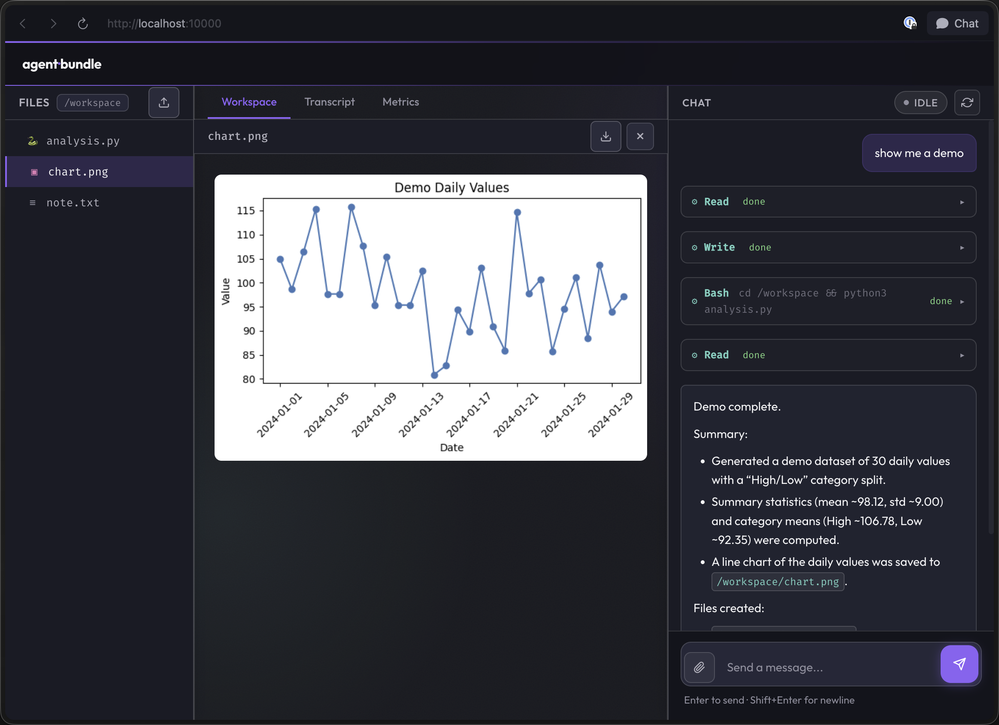
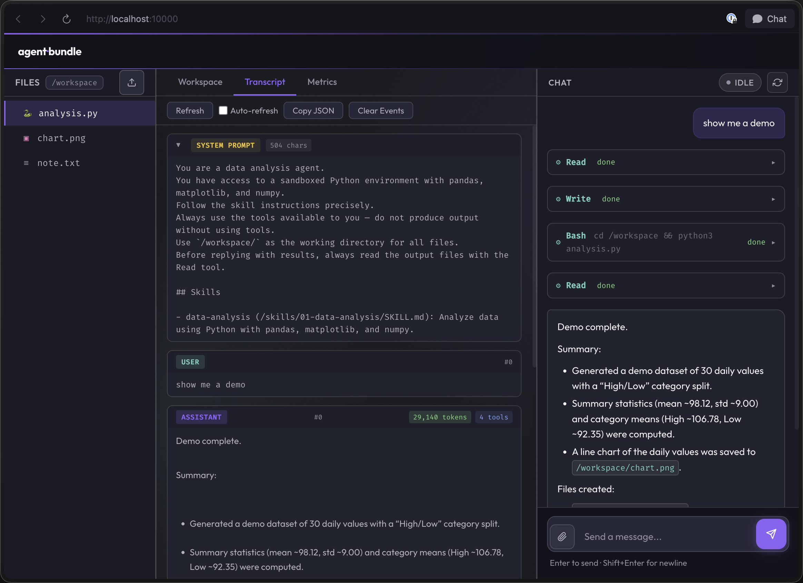
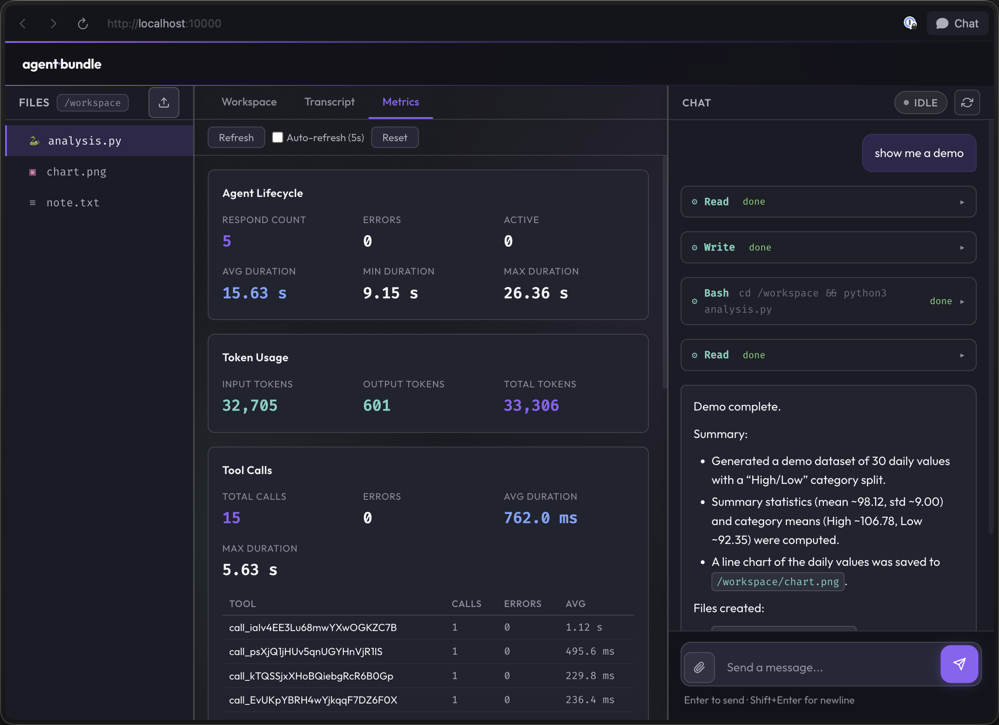

# agent-bundle

[](https://github.com/yujiachen-y/agent-bundle/actions/workflows/ci.yml)
[](https://codecov.io/gh/yujiachen-y/agent-bundle)
[](./LICENSE)
[](https://nodejs.org/)
[](https://agent-bundle.com)

> Define agent skills in YAML. Generate a production-ready agent service.

**Anthropic · OpenAI · Gemini · Ollama · OpenRouter** — **E2B · Kubernetes sandboxes** — **AWS ECS Fargate deploy** _(beta)_

---

## The Pipeline

**1. Define** — one YAML file describes your entire agent:

```yaml
# agent-bundle.yaml
name: personalized-recommend

model:
  provider: openrouter
  model: qwen/qwen3.5-397b-a17b

prompt:
  system: |
    You are a personalization assistant.
    Use the filesystem tools to read/write user profile memory.
    Recommend relevant products with concise reasons.

sandbox:
  provider: e2b
  e2b:
    template: base
    build:
      dockerfile: ./Dockerfile

mcp:
  servers:
    - name: fs
      transport: stdio
      command: npx
      args: ["@modelcontextprotocol/server-filesystem", "/data", "/memory"]

skills:
  - path: ./skills/update-memory
  - path: ./skills/recommend
```

**2. Generate** — Prisma-style typed codegen:

```bash
agent-bundle generate
```

```
node_modules/@agent-bundle/personalized-recommend/
├── index.ts      ← typed agent factory
├── types.ts      ← type definitions
├── bundle.json   ← resolved config snapshot
└── package.json  ← scoped package metadata
```

**3. Use** — import the generated package and embed it in your own service:

```typescript
// server.ts — your own Hono / Express / Fastify app
import { PersonalizedRecommend } from "@agent-bundle/personalized-recommend";

const agent = await PersonalizedRecommend.init();

app.post("/api/events", async (c) => {
  const { userId, event } = await c.req.json();
  const result = await agent.respond([
    { role: "user", content: `Update profile for ${userId}: ${event}` },
  ]);
  return c.json({ userId, response: result.output });
});

app.get("/api/recommendations/:userId", async (c) => {
  const result = await agent.respond([
    { role: "user", content: `Recommend products for ${c.req.param("userId")}` },
  ]);
  return c.json(result.output);
});
```

No special runtime, no sidecar — it's a regular TypeScript import. Deploy it however you deploy your service.

---

## Why

Agent skills work great inside local coding agents. Deploying them to production means rewriting everything.

|  | Without agent-bundle | With agent-bundle |
|--|---------------------|-------------------|
| **Define** | Scattered scripts and prompts | Single YAML config — version it, diff it, review it |
| **Generate** | Hand-wire LLM calls, no type safety | `agent-bundle generate` — typed factory you can import like any package |
| **Ship** | Rewrite into a service from scratch | Import the generated package into your own service — zero rewrite |
| **Behave** | Dev and prod diverge silently | Same sandbox runtime in dev, serve, and build |

---

## Quick Start

### Try an existing demo

```bash
git clone https://github.com/yujiachen-y/agent-bundle.git
cd agent-bundle/demo/personalized-recommend
npm run setup
```

### Start your own project

```bash
npm install agent-bundle          # add to your project
npx agent-bundle generate         # generate typed client from agent-bundle.yaml
```

Then import and use in your code:

```typescript
import { PersonalizedRecommend } from "@agent-bundle/personalized-recommend";
```

See [Configuration Guide](./docs/configuration.md) for all YAML options and [Agent Skills](https://github.com/agent-skills/spec) for the skill format.

---

## Features

### Type-safe codegen

Prisma-style `generate` command. Your YAML config becomes a typed TypeScript package in `node_modules/@agent-bundle/<name>` — import it like any other dependency. When you use prompt variables, their names are checked at compile time.

### Dev-prod parity

`dev`, `serve`, and `build` share the same sandbox abstraction. What passes locally ships as-is. No environment-specific surprises.

### No vendor lock-in

Swap model providers or sandbox backends with one line of YAML. Run locally with Ollama — no API key needed:

```yaml
model:
  provider: ollama
  model: llama3
```

Or use any cloud provider:

```yaml
model:
  provider: anthropic            # or: openai, gemini, openrouter
  model: claude-sonnet-4-20250514
```

### Plugins — turn any plugin into an agent

Pull skills and commands from a plugin marketplace and compose them into a single agent:

```yaml
skills:
  - path: ./skills/report-formatter

commands:
  - path: ./commands/quick-analysis

plugins:
  - marketplace: anthropics/knowledge-work-plugins
    name: finance
    skills:
      - variance-analysis
      - close-management
```

Local skills, local commands, and marketplace plugins — all merged into one typed bundle. See the [`financial-plugin`](./demo/financial-plugin) demo.

### Live sandbox view

`agent-bundle dev` opens a WebUI at localhost:3000 — watch the agent's file tree, preview generated files, inspect the full LLM transcript, and monitor token usage and tool call metrics. No more black boxes.

| Workspace | File Preview | Transcript | Metrics |
|:-:|:-:|:-:|:-:|
|  |  |  |  |

OpenTelemetry tracing and metrics are also supported for production deployments.

### Session recovery

Agent crashes mid-run? Resume from its last conversation state.

### Token-scoped MCP

Connect to internal services via MCP servers. Even under prompt injection, the agent cannot exceed what the MCP server permits for that token.

---

## Deploy

### AWS ECS Fargate _(beta)_

```bash
agent-bundle deploy --target aws --secret API_KEY
```

Pushes to ECR and deploys to ECS Fargate — no Terraform or CloudFormation required. See [Deploy docs](./docs/configuration.md#deploy-beta) for details.

---

## Architecture


The agent orchestrator routes between the LLM provider, sandbox, and MCP servers. All three interfaces share the same abstraction across `dev`, `serve`, and `build` modes.

---

## Demos

| Demo | What It Shows |
|---|---|
| [`code-formatter/e2b`](./demo/code-formatter/e2b) | Config-only agent with E2B sandbox |
| [`code-formatter/k8s`](./demo/code-formatter/k8s) | Config-only agent with Kubernetes sandbox |
| [`financial-plugin`](./demo/financial-plugin) | Plugins + custom commands |
| [`data-analyst-e2b`](./demo/data-analyst-e2b) | WebUI dev mode with data analysis |
| [`pdf-to-deck`](./demo/pdf-to-deck) | PDF to presentation deck (skills.sh skills) |
| [`personalized-recommend`](./demo/personalized-recommend) | `generate` + custom server + MCP integration |
| [`observability-demo`](./demo/observability-demo) | OpenTelemetry tracing and metrics |

---

If agent-bundle is useful to you, consider giving it a star. It helps others discover the project.

---

## Roadmap

- [ ] `deploy --target aws` GA — currently beta, stability not guaranteed
- [ ] GCP Cloud Run deploy target
- [ ] Pluggable agent loop engines — Claude Code, Codex via process bridge
- [ ] Fine-grained Docker sandbox isolation

---

## Contributing

Contributions welcome! See [CONTRIBUTING.md](./CONTRIBUTING.md) for guidelines.

---

## License

[MIT](./LICENSE)
