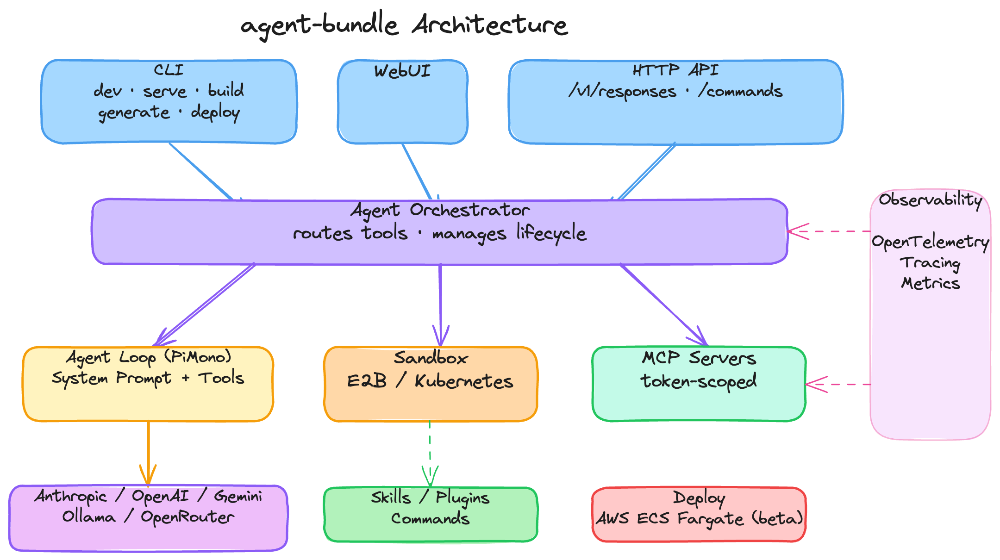

# agent-bundle

[](https://github.com/yujiachen-y/agent-bundle/actions/workflows/ci.yml)
[](https://codecov.io/gh/yujiachen-y/agent-bundle)
[](./LICENSE)
[](https://nodejs.org/)

> Bundle skills into a single deployable agent.

*Sandboxed execution. Token-scoped data access.*

<!-- TODO: demo GIF — `agent-bundle serve` opening TUI + WebUI showing file tree and live terminal -->

---

## Why

**One YAML. Dev-to-prod in minutes, not months.**

Agent Skills work great inside local coding agents. Getting them into production is a different story.

|  | Without agent-bundle | With agent-bundle |
|--|---------------------|-------------------|
| **Develop** | Skills run in local coding agents only | `agent-bundle serve` — TUI + WebUI with live sandbox view |
| **Ship** | Rewrite skill logic into a service from scratch | `agent-bundle build` — typed TypeScript factory + Docker image |
| **Behave** | Dev and prod diverge silently | Same sandbox runtime in both modes |

---

## How It Works



---

## Quick Start

### 1. Install

```bash
pnpm add -g agent-bundle
```

### 2. Define your bundle

```yaml
# bundle.yaml
name: my-agent

model:
  provider: anthropic
  model: claude-sonnet-4-20250514

sandbox:
  provider: kubernetes
  kubernetes:
    image: my-sandbox:latest

skills:
  - path: ./skills/my-skill
```

See [Agent Skills](https://github.com/agent-skills/spec) for the skill format and [Configuration Guide](./docs/configuration.md) for all options.

### 3. Run locally

```bash
agent-bundle serve
```

Starts a TUI for interactive testing. A WebUI at `http://localhost:3000` lets you watch the agent's file tree and terminal output in real time — see exactly what it's doing inside the sandbox.

### 4. Build for deployment

```bash
agent-bundle build
```

Produces a typed, embeddable package:

```
dist/my-agent/
├── index.ts      ← typed agent factory
├── types.ts      ← variable types
└── bundle.json   ← config snapshot
```

If `sandbox.kubernetes.build` is configured, `agent-bundle build` runs a local `docker build` for that image tag. Image push/import is still an explicit user step.

Integrate into any Node.js service:

```typescript
import { MyAgent } from "./dist/my-agent";

const agent = await MyAgent.init({
  variables: { user_name: "Alice" },
  hooks: {
    preMount: async (io) => {
      await io.file.write("/workspace/invoice.pdf", pdfBuffer);
    },
    postUnmount: async (io) => {
      const result = await io.file.read("/workspace/output.json");
      await uploadToS3(result);
    },
  },
});

const response = await agent.respond("Extract all line items");
await agent.shutdown();
```

Variable names are checked at compile time. Miss one and it won't build.

---

## Key Features

**See inside the sandbox.** In `serve` mode, a WebUI at `localhost:3000` shows the agent's live file tree and terminal output as it runs. No more guessing what the agent is doing.

<!-- TODO: screenshot — WebUI showing file tree on the left, live terminal output on the right -->

**No vendor lock-in.** Swap model providers or sandbox backends with one line of YAML. Supports Anthropic, OpenAI, Gemini, Ollama, and any OpenAI-compatible proxy; E2B and Kubernetes sandboxes.

**Consistent runtime across environments.** `serve` and `build` run through the same sandbox abstraction. What passes locally ships as-is.

**Session recovery.** If an agent crashes mid-run, resume from its last conversation state:

```typescript
const agent = await MyAgent.init({
  variables: { user_name: "Alice" },
  session: savedSessionState,
});
```

Conversation history is restored automatically. Sandbox files are re-seeded via your `preMount` hook.

**MCP for controlled data access.** Connect the agent to internal services via token-scoped MCP servers. Even under prompt injection, the agent cannot exceed what the MCP server permits for that token. See [Configuration Guide](./docs/configuration.md#mcp-servers) for setup.

---

## HTTP API

agent-bundle exposes an [Open Responses](https://github.com/open-responses/open-responses)-compatible endpoint in both `serve` and `build` modes. Any OpenAI SDK connects by overriding `baseURL`:

```
POST /v1/responses
{ "input": "Extract all line items from the invoice", "stream": true }
```

---

## Roadmap

- [ ] Pluggable agent loop engines — Claude Code, Codex via process bridge
- [ ] Fine-grained Docker sandbox isolation

---

## Contributing

Contributions welcome! See [CONTRIBUTING.md](./CONTRIBUTING.md) for guidelines.

---

## License

[MIT](./LICENSE)
