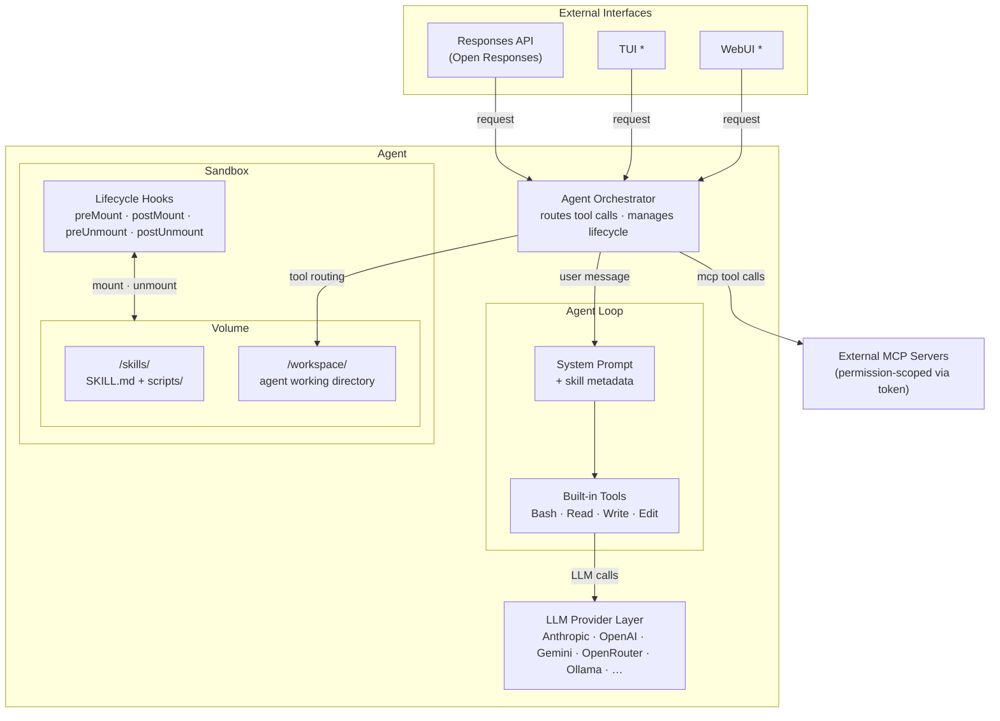

# Agent Bundle Proposal

> Bundle skills into a single deployable agent.

## Background

Since Anthropic open-sourced the Agent Skills standard in late 2025, skills have become the de facto unit of capability for coding agents. OpenAI and other major players have adopted the standard, and the industry consensus is shifting from writing code directly to building reusable skills that agents execute on behalf of users.

## Problem Statement

The Agent Skills widely used today do not yet map naturally to an online-service ecosystem. They work well inside local coding agents, but there is still no effective, standardized path to deploy them as online services.

This creates a structural gap and significant friction between local development and production environments:

1. Deployment limitations  
   Teams can share skills for local use, but consumers must manually install them in their own agent setups. These skills cannot be published and operated as first-class online services.
2. Organizational impact
   This friction is tolerable for individual users but scales poorly. All three major cloud vendors have launched initiatives to address this gap [3][4][5], and industry data shows only 5-14% of agentic AI projects successfully transition from pilot to production [1][2].
3. Technical debt and migration cost  
   To ship online, developers must rewrite logic and add deployment-specific validation. This creates high migration cost, inconsistency between offline and online behavior, and long-term maintenance burden.


## Proposed Solution

We propose a lightweight, self-contained agent runtime that loads a curated set of Agent Skills, executes them via a built-in agent loop, and exposes the result as a deployable service.

The runtime consists of the following core components:

1. Built-in Agent Loop
   A lightweight loop that handles tool calling and structured output for each incoming request. Skills are plain SKILL.md files seeded into the sandbox at build time; skill summaries are baked into the system prompt, and the agent reads full skill content on demand via built-in tools.
2. LLM Provider Layer
   Supports major providers natively (Anthropic, OpenAI, Gemini) and accepts third-party provider proxies such as LiteLLM and OpenRouter. For local development and personal use, it also supports Ollama, Codex OAuth, and Claude `setup-token` for accessing local or third-party compute.
3. Service Interface
   Exposes a minimal external API surface (an Open Responses-compatible HTTP API) for external integration. Encapsulates internal mechanics including agent-loop orchestration, sandbox management, and filesystem setup.

The runtime is packaged into a Docker image via a YAML-driven configuration, producing a single deployable artifact ready for cloud or local use.

## What This Is Not

Agent Bundle is not a wrapper around existing user-facing agent tools such as Claude Code, Codex, or Cursor. The v1 built-in agent loop is implemented using pi-mono as an internal library; this is a deliberate implementation choice, not a user-facing dependency. The service interface, sandbox abstraction, and build pipeline are all agent-bundle's own design.

## Goals and Non-Goals

### Goals

1. Provide a YAML-driven tool that declares a bundle (skills, model, permissions) and produces a runnable agent in two modes:
   - `serve` — runs as a local process for development and testing
   - `build` — produces a Docker image for online deployment
2. Include a built-in runtime in both modes:
   - a simple Agent Loop for request execution
   - a k3d-based sandbox for `serve` mode; E2B or Kubernetes for `build` mode
3. Expose built-in service interfaces appropriate to each mode:
   - a minimal Open Responses-compatible HTTP API (available in both modes)
   - terminal/TUI and WebUI with live file tree and terminal output (local `serve` mode only)
4. Keep token and model-consumption strategy externally configurable by users.

### Non-Goals

1. Token and compute provisioning  
   We do not provide token budgets or LLM compute. Users must bring their own model access and related resources.
2. Persistence layer  
   The packaged runtime is fundamentally stateless and may be destroyed after use. Users are responsible for external persistence and for coordinating reloadable/re-entrant agent execution.
3. Skill security validation (current scope)  
   Users are responsible for ensuring packaged skills are valid and non-malicious. We may add baseline behavioral checks in the future, but that is outside the current core scope.
4. Cloud deployment orchestration
   We only produce a deployable image artifact and do not own downstream cloud deployment workflows.

## Future Work

The following items are intentionally excluded from the initial scope but may be explored in later iterations:

1. Pluggable Agent Loop engines
   The initial release ships a single built-in agent loop. Supporting pluggable or user-supplied loop implementations may be considered once the core runtime stabilizes.
2. Advanced sandbox integrations
   The initial release provides a basic built-in sandbox service. Docker-oriented sandboxing with fine-grained isolation may be added based on user demand.

## Design Overview

### Architecture



\* TUI and WebUI are available in local `serve` mode only.

### Sandbox

The sandbox abstraction provides a provider-agnostic interface for tool execution and file operations. Two providers are supported in v1: **E2B** (managed cloud sandboxes) and **Kubernetes** (self-hosted via k3d or any K8s cluster). Both `serve` and `build` modes run through the sandbox to ensure behavioral consistency; `serve` defaults to a local Docker/k3d sandbox.

#### Lifecycle

All hooks execute while the sandbox is alive and IO is available.

```
create ──► preMount ──► postMount ──► [agent session] ──► preUnmount ──► postUnmount ──► destroy
           (seed files)  (validate)                       (collect)      (upload/notify)
```

1. **create** — Sandbox infrastructure is provisioned (E2B sandbox started / K8s pod running). IO becomes available.
2. **preMount** — Seed session-specific files into the sandbox (e.g., user uploads, session config).
3. **postMount** — Validate setup, warm caches, run health checks. Sandbox is ready for the agent.
4. **[agent session]** — The agent loop runs. All tool calls are routed to the sandbox.
5. **preUnmount** — Agent session ends. Collect artifacts, flush logs, snapshot state.
6. **postUnmount** — Upload artifacts to external storage, notify external systems, clean up.
7. **destroy** — Sandbox infrastructure is torn down. All resources released.

#### Configuration

Common fields (timeout, resources) are provider-agnostic. Provider-specific settings go under the provider key only when needed.
`resources` follows an all-or-nothing override model: omit it to use defaults (`cpu: 2`, `memory: 512MB`), or provide both fields explicitly.

```yaml
sandbox:
  provider: e2b              # or: kubernetes
  timeout: 900               # seconds
  resources:
    cpu: 2
    memory: 512MB

  # Provider-specific (optional)
  e2b:
    template: my-custom-template

  # kubernetes:
  #   namespace: agent-sandbox
  #   nodeSelector:
  #     gpu: "true"

  serve:                     # override for serve mode (optional)
    provider: kubernetes     # defaults to local docker/k3d
```

#### Interface

**build** (CLI only, offline)

Reads the bundle YAML, packages skills and base tools into a sandbox template or image. For E2B this produces and uploads a template; for Kubernetes this builds and pushes a Docker image. This is not exposed as a runtime API — users run `agent-bundle build` from the CLI.

**Sandbox object** (runtime)

Created in memory with configuration and lifecycle hooks. No real resources are allocated until `start()` is called. Hooks are registered as constructor parameters.

```typescript
interface SandboxHooks {
  preMount?: (io: SandboxIO) => Promise<void>;
  postMount?: (io: SandboxIO) => Promise<void>;
  preUnmount?: (io: SandboxIO) => Promise<void>;
  postUnmount?: (io: SandboxIO) => Promise<void>;
}

interface ExecResult {
  stdout: string;
  stderr: string;
  exitCode: number;
}

interface FileEntry {
  name: string;
  path: string;
  type: "file" | "directory";
}

interface SandboxIO {
  exec(command: string, opts?: {
    timeout?: number;
    cwd?: string;
    onChunk?: (chunk: string) => void;  // real-time output for human consumers (TUI, WebUI, extensions)
  }): Promise<ExecResult>;
  file: {
    read(path: string): Promise<string>;
    write(path: string, content: string | Buffer): Promise<void>;
    list(path: string): Promise<FileEntry[]>;
    delete(path: string): Promise<void>;
  };
}

type SandboxStatus =
  | "idle"      // created in memory, not yet started
  | "starting"  // provisioning infrastructure + running hooks
  | "ready"     // agent can use the sandbox
  | "stopping"  // running shutdown hooks + destroying
  | "stopped";  // all resources released

interface Sandbox extends SandboxIO {
  readonly id: string;
  readonly status: SandboxStatus;

  start(): Promise<void>;     // create → preMount → postMount → ready
  shutdown(): Promise<void>;  // preUnmount → postUnmount → destroy
}
```

#### Design Decisions

- **No path restrictions.** The sandbox is ephemeral (1:1 session model). Skills in `/skills/` are restored on every new session. The agent has full freedom within the sandbox; no write-protection is enforced on any path.
- **exec returns the full result on completion, with optional real-time streaming.** The `onChunk` callback provides real-time output chunks for human consumers (TUI, WebUI, extensions) while the command runs. The LLM only sees the final `ExecResult`. This matches pi-mono's Bash tool model: `onChunk` feeds `tool_execution_update` events to the UI layer, while the agent loop waits for the final result to send back to the LLM.
- **Hooks receive `SandboxIO`, not the full `Sandbox`.** This prevents hooks from accidentally calling `start()` or `shutdown()`. Hooks can use both `exec` and `file` operations without restriction.

#### Providers

| Provider | `start()` | `exec()` / `file.*` | `shutdown()` |
|---|---|---|---|
| **E2B** | `Sandbox.create(template)` | E2B SDK: `commands.run()`, `files.read/write()`. Streaming via native `onStdout`/`onStderr` callbacks. | `sandbox.kill()` |
| **Kubernetes** | Create pod from image, wait for ready | execd HTTP endpoints: `/command/run`, `/files/*`. Streaming via SSE on the `/command/run` endpoint. | Delete pod |

### Agent Loop

The agent loop handles LLM interaction: it sends the system prompt and user messages to the LLM, receives tool call decisions, and returns the final response. It does **not** own the sandbox — the Agent orchestrator (see below) wires tool calls from the loop to the sandbox.

#### Interface

```typescript
interface AgentLoop {
  init(config: {
    systemPrompt: string;
    model: ModelConfig;
    toolHandler: (call: ToolCall) => Promise<ToolResult>;
  }): Promise<void>;

  run(input: ResponseInput): AsyncIterable<ResponseEvent>;
  dispose(): Promise<void>;
}
```

`toolHandler` is a callback provided by the Agent orchestrator. When the LLM decides to call a tool (Bash, Read, Write, Edit), the agent loop invokes `toolHandler`, which routes the call to the sandbox. The loop does not know what sandbox is or how it works.

#### LLM Provider

Follows pi-mono's conventions. Provider and model are specified in the bundle YAML; API keys are resolved from environment variables automatically (e.g., `ANTHROPIC_API_KEY`, `OPENAI_API_KEY`). No secrets in YAML.

```yaml
model:
  provider: anthropic
  model: claude-sonnet-4-20250514
```

pi-mono's `@mariozechner/pi-ai` package handles provider initialization, auth methods (API keys, OAuth tokens, `claude setup-token`), and request routing. agent-bundle passes through the configuration without building its own provider layer.

#### System Prompt

The system prompt is generated at build time from the bundle YAML and skill metadata. User-defined variables are declared in the YAML and filled at runtime.

```yaml
prompt:
  system: |
    You are an expert invoice processing assistant.
    Current user: {{user_name}}
    Timezone: {{timezone}}

  variables:
    - user_name
    - timezone
```

Skills are automatically appended to the system prompt at build time (not via a placeholder). Each skill's SKILL.md frontmatter (name + description) is injected by default. The agent reads full SKILL.md content on demand via its tools during the session.

At runtime, only variables need to be filled. Build-time generation freezes the prompt template — zero runtime cost for prompt assembly.

#### Providers

v1 ships with pi-mono. The interface supports future agent loops via direct integration (TypeScript) or process bridges (CLI-based tools).

| Agent Loop | Language | Integration | Status |
|---|---|---|---|
| **pi-mono** | TypeScript | In-process, sandbox-backed Operations | v1 |
| Other TS loops | TypeScript | In-process or fork | Future |
| Claude Code | CLI (Node) | Bridge: spawn process, message protocol | Future |
| Codex | CLI (Rust) | Bridge: spawn process, message protocol | Future |

For pi-mono specifically, the `toolHandler` is implemented by injecting sandbox-backed operation interfaces into pi-mono's tool layer:

```
pi-mono Tool Layer (host)
  │
  ├── Read tool  ──► ReadOperations  ──► sandbox.file.read()
  ├── Write tool ──► WriteOperations ──► sandbox.file.write()
  ├── Edit tool  ──► ReadOperations + WriteOperations
  │                  (pi-mono handles fuzzy matching, BOM, line endings;
  │                   file IO delegates to sandbox)
  └── Bash tool  ──► BashOperations  ──► sandbox.exec()
```

This preserves pi-mono's full tool logic (Edit's fuzzy matching, output truncation, etc.) while routing all IO to the sandbox.

### Agent

The Agent is the top-level orchestrator. It owns both the sandbox and the agent loop, wires them together, and exposes the client-facing API.

```
Agent (orchestrator)
  ├── Sandbox (tool execution environment)
  ├── AgentLoop (LLM interaction)
  └── wiring: loop.toolHandler → sandbox.exec / sandbox.file.*
```

#### Build Pipeline

The bundle YAML is a build-time input. `agent-bundle build` produces two artifacts:

1. **Sandbox image** — pushed to E2B (template) or Docker registry (image). Contains skills and base tools.
2. **Agent factory** — generated TypeScript code with all configuration baked in (system prompt template, model config, sandbox image reference, typed variables).

```
agent-bundle.yaml + skills/
        │
        ▼
  agent-bundle build
        │
        ├── push sandbox image/template
        └── generate code artifact
                │
                ▼
        dist/invoice-processor/
          ├── index.ts          generated agent factory
          ├── bundle.json       config snapshot
          └── types.ts          variable types
```

No YAML is loaded at runtime. The generated artifact is self-contained.

#### Agent Factory

`agent-bundle build` generates a typed agent factory:

```typescript
// generated: dist/invoice-processor/index.ts
import { defineAgent } from "agent-bundle/runtime";

export const InvoiceProcessor = defineAgent({
  name: "invoice-processor",
  sandbox: { provider: "e2b", template: "invoice-processor:a3f8c2d" },
  model: { provider: "anthropic", model: "claude-sonnet-4-20250514" },
  systemPrompt: "You are an expert...\n\n## Skills\n...",
  variables: ["user_name", "timezone"] as const,
});

// generated: dist/invoice-processor/types.ts
export interface InvoiceProcessorVariables {
  user_name: string;
  timezone: string;
}
```

Usage:

```typescript
import { InvoiceProcessor } from "./dist/invoice-processor";

const agent = await InvoiceProcessor.init({
  variables: { user_name: "Alice", timezone: "UTC+8" },
  hooks: {
    preMount: async (io) => {
      await io.file.write("/workspace/invoice.pdf", pdfBuffer);
    },
    postUnmount: async (io) => {
      const result = await io.file.read("/workspace/output.json");
      await uploadToS3(result);
    },
  },
});
```

`InvoiceProcessor` is an agent factory (reusable). `.init()` creates an Agent instance (has a running sandbox + agent loop).

#### Agent Interface

```typescript
interface Agent {
  readonly name: string;
  readonly status: "ready" | "running" | "stopped";

  respond(input: ResponseInput): Promise<ResponseOutput>;
  respondStream(input: ResponseInput): AsyncIterable<ResponseEvent>;
  shutdown(): Promise<void>;
}
```

`respond` waits for the full agent response. `respondStream` returns an async iterable of SSE-compatible events following the [Open Responses](https://github.com/open-responses/open-responses) spec.

#### Init Sequence

```
InvoiceProcessor.init({ variables, hooks })
  │
  ├── 1. Fill system prompt template (replace variables, skills already baked in)
  ├── 2. Create Sandbox (image ref baked in)
  │       └── sandbox.start() → preMount → postMount → ready
  ├── 3. Create AgentLoop (pi-mono for v1)
  │       └── loop.init({ systemPrompt, model, toolHandler })
  │           toolHandler routes to sandbox.exec / sandbox.file.*
  └── 4. Return Agent instance
```

#### HTTP Interface

In `serve` mode, agent-bundle exposes an [Open Responses](https://github.com/open-responses/open-responses)-compatible HTTP API. Any OpenAI SDK can connect by overriding `baseURL`.

```
POST /v1/responses
{
  "input": "Extract all line items from the uploaded invoice",
  "stream": true
}

// SSE events:
data: {"type": "response.created", ...}
data: {"type": "response.output_text.delta", "delta": "The invoice contains..."}
data: {"type": "response.completed", ...}
```

#### Session Model

Sessions support error recovery. If an agent crashes mid-execution, the session can be resumed by passing the saved conversation history into a new `init()` call.

```typescript
interface SessionState {
  conversationHistory: ResponseInput;
}
```

The `session` field is an optional parameter in `InitOptions`:

```typescript
const agent = await InvoiceProcessor.init({
  variables: { user_name: "Alice", timezone: "UTC+8" },
  session: savedState,  // omit for a fresh session
});
```

**What is and is not restored on resume:**

- **Conversation history** — restored from `SessionState`. The LLM has full context of previous work.
- **Sandbox files** — not automatically restored. The sandbox is re-provisioned from scratch (`preMount` runs again). Restoring sandbox files from a previous session is the caller's responsibility via `preMount` (e.g., re-fetch artifacts from external storage).

Session persistence is the caller's responsibility. agent-bundle provides the `SessionState` interface and accepts it at `init()`; storage and retrieval are left to the business layer.

### MCP Integration

The agent can invoke tools on external MCP servers to access internal services (e.g., user data, domain operations) from within the sandbox.

#### Accessing Internal Services

External MCP servers are declared in the bundle YAML. At session creation, the caller injects per-user tokens; the agent runtime uses these tokens when establishing MCP connections.

```yaml
mcp:
  servers:
    - name: refund-service
      url: https://internal.example.com/mcp/refund
      auth: bearer
    - name: inventory-service
      url: https://internal.example.com/mcp/inventory
      auth: bearer
```

Tokens are passed at `init()` time:

```typescript
const agent = await InvoiceProcessor.init({
  variables: { user_name: "Alice", timezone: "UTC+8" },
  mcpTokens: {
    "refund-service": userRefundToken,
    "inventory-service": userInventoryToken,
  },
});
```

#### Security Model

The agent runs inside a sandbox (high-privilege compute environment). External MCP servers sit outside the sandbox as controlled gateways:

```
Sandbox (agent execution)
  └── MCP client (in agent runtime process, outside sandbox)
        └── External MCP server (validates token, scopes to current user)
```

The token passed to each MCP server scopes all operations to the current user's resources. Even if the agent is subject to prompt injection, it cannot exceed what the MCP server permits for that token. This is defense-in-depth: sandbox isolation bounds compute, MCP token scoping bounds data access.

#### Tool Routing

MCP tool calls are routed by the Agent Orchestrator alongside built-in sandbox tools:

```
Agent Orchestrator (toolHandler)
  ├── Built-in tools (Bash, Read, Write, Edit) → sandbox.exec / sandbox.file.*
  └── MCP tools (declared in YAML)            → MCP client → external MCP server
```

## Implementation Plan

Tasks are grouped into phases. Tasks within a phase can proceed in parallel. Each task targets a single PR with ≤ 1000 lines of diff.

---

### Phase 1: Foundation

*No dependencies. All tasks in this phase can proceed in parallel.*

#### F1: Project Scaffold and CLI Skeleton

**Scope**: Set up `src/` directory structure, TypeScript build config, CLI entrypoint with `serve`/`build` command routing, and YAML file loading.

**Details**:
- `typescript` devDependency, `tsconfig.json` targeting ESM (`"module": "nodenext"`, `"target": "es2022"`)
- `src/cli/index.ts` CLI entrypoint with lightweight arg parser (e.g. `citty`). Two commands: `agent-bundle serve [--config path]` and `agent-bundle build [--config path]`, defaulting to `./agent-bundle.yaml`
- Both commands are stubs: load + validate YAML (using F2's schema) and print parsed config
- `"bin"` field in `package.json`, `yaml` dependency, `"build"` script using `tsc`
- Use `pnpm` as the package manager (`pnpm-lock.yaml` in repo root, `pnpm run` for scripts)
- Update `eslint.config.mjs` and `vitest.config.ts` to include `src/**`

**Depends on**: none

**Produces**: CLI entrypoint (`src/cli/index.ts`), `loadBundleConfig(path)` function, updated build/lint/test config.

---

#### F2: Bundle YAML Schema (Zod)

**Scope**: Define and export a Zod schema for the full `agent-bundle.yaml` configuration.

**Details**:
- `zod` dependency. Create `src/schema/bundle.ts`
- Top-level shape: `name` (required, kebab-case), `model` (`{ provider, model }`), `prompt` (`{ system, variables? }`), `sandbox` (provider, timeout, resources, provider-specific keys, serve override), `skills` (union: `{ path }` | `{ github, skill?, ref? }` | `{ url, version? }`), `mcp?` (servers array: `{ name, url, auth }`)
- Export `BundleConfig` inferred type, `parseBundleConfig(raw): BundleConfig`, and `bundleSchema`
- Tests: valid config, missing required fields, invalid provider, skill union discrimination, sandbox defaults

**Depends on**: none

**Produces**: `BundleConfig` type, `parseBundleConfig()`, `bundleSchema`. Used by F1, F3, S1, S2, S3.

---

#### L1: AgentLoop Interface and Core Types

**Scope**: Define the `AgentLoop` interface and all types shared across the agent loop boundary.

**Details**:
- `src/agent-loop/types.ts`: `ModelConfig`, `ToolCall`, `ToolResult`, `ResponseInput` (array of role+content messages with tool_calls/tool_results for round-trip), `ResponseEvent` (discriminated union: `response.created`, `response.output_text.delta`, `response.output_text.done`, `response.tool_call.created`, `response.tool_call.done`, `tool_execution_update`, `response.completed`, `response.error`), `ResponseOutput` (`{ id, output, usage }`)
- `src/agent-loop/agent-loop.ts`: `AgentLoopConfig` (`{ systemPrompt, model, toolHandler }`), `AgentLoop` interface (`init`, `run`, `dispose`)
- Pure type definitions — no implementation. Barrel export from `src/agent-loop/index.ts`

**Depends on**: none

**Produces**: All types consumed by L2, L3, A1, SV1, B1.

---

#### S1: Sandbox Abstraction (Interfaces)

**Scope**: Define and export all sandbox-related TypeScript interfaces and types.

**Details**:
- `src/sandbox/types.ts`: `SandboxIO` (exec + file CRUD), `SandboxHooks` (preMount/postMount/preUnmount/postUnmount), `ExecResult`, `FileEntry`, `SandboxStatus`, `Sandbox` (extends `SandboxIO` with `id`, `status`, `start()`, `shutdown()`)
- `SandboxConfig` type derived from the bundle schema sandbox section
- Factory signature: `type CreateSandbox = (config: SandboxConfig, hooks: SandboxHooks) => Sandbox`
- Barrel export from `src/sandbox/index.ts`
- Pure type definitions — no tests needed

**Depends on**: none (mirrors F2's sandbox schema section but is just types)

**Produces**: All sandbox types/interfaces. Used by S2, S3, S4, A1, UI2.

---

#### L2: System Prompt Generation

**Scope**: Build-time template generator and runtime variable filler for system prompts.

**Details**:
- Build-time generator (`src/agent-loop/system-prompt/generate.ts`): `generateSystemPromptTemplate({ basePrompt, skills: SkillSummary[] }): string`. Appends `## Skills` section listing each skill's name, description, and location (`/skills/<name>/SKILL.md`). Variables remain as `{{var_name}}` placeholders
- Runtime filler (`src/agent-loop/system-prompt/fill.ts`): `fillSystemPrompt(template, variables): string`. Simple `{{key}}` replacement; throws on unfilled required placeholders
- Tests: template generation with 0/1/N skills, variable filling with complete/partial/extra variables, error on missing required variables

**Depends on**: none

**Produces**: `generateSystemPromptTemplate` (used by B1), `fillSystemPrompt` (used by A1).

---

### Phase 2: Providers and Skill Loading

*Depends on Phase 1 types being available.*

#### F3: Skill Loader

**Scope**: Parse SKILL.md frontmatter, load skill content from local/GitHub/URL sources, cache remote skills.

**Details**:
- `src/skills/loader.ts`. `Skill` type: `{ name, description, content, sourcePath }`
- `loadSkill(entry: SkillEntry): Promise<Skill>` — dispatches by entry variant:
  - `path`: read SKILL.md from local fs relative to bundle YAML location
  - `github`: fetch from `raw.githubusercontent.com/{owner}/{repo}/{ref}/{path}/SKILL.md`, default `ref` to `"main"`
  - `url`: fetch URL directly, append `/SKILL.md` if URL doesn't end with `.md`
- `loadAllSkills(entries, basePath): Promise<Skill[]>` — parallel loading
- Cache remote fetches to `node_modules/.cache/agent-bundle/skills/{sha256-hash}`. Cache option `{ cache?: boolean }` defaults to true
- Tests: local path loading (mock fs), frontmatter parsing (valid/missing fields), cache hit/miss (mock fetch). No live network calls

**Depends on**: F2 (`SkillEntry` type from bundle schema)

**Produces**: `Skill` type, `loadSkill()`, `loadAllSkills()`. Used by B1 (build pipeline), L2 (system prompt).

---

#### S2: E2B Sandbox Provider

**Scope**: Implement `Sandbox` using the E2B SDK.

**Details**:
- `@e2b/code-interpreter` dependency. `src/sandbox/providers/e2b.ts`
- `E2BSandbox implements Sandbox`: constructor receives `SandboxConfig` + `SandboxHooks`, sets `status = "idle"`, id = `e2b-{nanoid()}`
- `start()`: create E2B sandbox via SDK, run preMount/postMount hooks, transition to `"ready"`
- `exec()`: `sandbox.commands.run()` with `onStdout`/`onStderr` wired to `onChunk`
- `file.*`: delegate to E2B SDK `files.read/write/list`, delete via `commands.run("rm -rf ...")`
- `shutdown()`: run preUnmount/postUnmount hooks, call `sandbox.kill()`
- Error during `start()` → cleanup + rethrow
- Tests: mock E2B SDK. Lifecycle transitions, hook invocation order, exec delegation, error cleanup

**Depends on**: S1 (sandbox interfaces)

**Produces**: `E2BSandbox` class. Used by S4 (sandbox factory).

---

#### S3: Kubernetes Sandbox Provider

**Scope**: Implement `Sandbox` using Kubernetes pod lifecycle and execd HTTP daemon.

**Details**:
- `@kubernetes/client-node` dependency. `src/sandbox/providers/kubernetes.ts`
- `K8sSandbox implements Sandbox`: constructor receives `SandboxConfig` + `SandboxHooks`, sets `status = "idle"`, id = `k8s-{nanoid()}`
- `start()`: build pod spec from config (namespace, nodeSelector, image, resource limits), create pod via `CoreV1Api.createNamespacedPod()`, poll until Ready, resolve execd base URL (pod IP or port-forward), health check `GET /health`, run preMount/postMount
- `exec()`: POST `{baseUrl}/command/run`, SSE streaming via `onChunk`
- `file.*`: REST endpoints on execd (`/files/read`, `/files/write`, `/files/list`, `/files/delete`)
- `shutdown()`: run preUnmount/postUnmount hooks, delete pod, stop port-forward
- Pod labels: `{ app: "agent-sandbox", "sandbox-id": id }`
- Tests: mock K8s client + fetch. Lifecycle transitions, pod spec construction, exec delegation, shutdown cleanup

**Depends on**: S1 (sandbox interfaces)

**Produces**: `K8sSandbox` class. Used by S4 (sandbox factory).

---

### Phase 3: Sandbox Factory and Agent Loop Implementation

*Depends on Phase 2 providers being available.*

#### S4: Sandbox Provider Registry

**Scope**: Factory function that maps a `provider` string from config to the correct `Sandbox` class.

**Details**:
- `src/sandbox/factory.ts`
- `createSandbox(config: SandboxConfig, hooks: SandboxHooks): Sandbox` — dispatches on `config.provider`:
  - `"e2b"` → `new E2BSandbox(config, hooks)`
  - `"kubernetes"` → `new K8sSandbox(config, hooks)`
  - Unknown → throw with actionable error message listing supported providers
- Handles `serve` mode override: if `config.serve?.provider` is set and mode is `"serve"`, use the override provider
- Export from `src/sandbox/index.ts` barrel
- Tests: correct class instantiated for each provider string, error on unknown provider, serve override applies

**Depends on**: S2 (E2BSandbox), S3 (K8sSandbox)

**Produces**: `createSandbox()` — consumed by A1 to create sandboxes from config.

---

#### L3: pi-mono AgentLoop Implementation

**Scope**: Implement `AgentLoop` using `@mariozechner/pi-ai`, with tool calls routed via the `toolHandler` callback.

**Details**:
- `src/agent-loop/pi-mono/pi-mono-loop.ts` — `PiMonoAgentLoop implements AgentLoop`
- `init()`: create pi-mono session, inject system prompt via `session.agent.setSystemPrompt()` (bypass pi-mono's built-in prompt assembly per spike finding). Wire pi-mono's tool layer to sandbox-backed operations via `toolHandler`:
  - `ReadOperations.readFile(path)` → `toolHandler({ name: "Read", input: { path } })`
  - `WriteOperations.writeFile(path, content)` → `toolHandler({ name: "Write", input: { path, content } })`
  - `BashOperations.exec(command)` → `toolHandler({ name: "Bash", input: { command } })`
  - Edit tool: pi-mono handles fuzzy matching/BOM/line-endings internally; file IO delegates via Read/WriteOperations
- `run(input)`: convert `ResponseInput` to pi-mono's format, call streaming API, map callbacks to `ResponseEvent` yields via async generator
- `dispose()`: clean up pi-mono session
- `ModelConfig` passed through to pi-mono's provider init (API keys from env vars)

**Depends on**: L1 (AgentLoop interface/types)

**Produces**: `PiMonoAgentLoop` — the only `AgentLoop` implementation in v1. Used by A1.

---

### Phase 4: Agent Orchestrator

*Depends on sandbox factory and agent loop implementation.*

#### A1: Agent Factory (`defineAgent`) and Session Model

**Scope**: Implement `defineAgent`, the `Agent` orchestrator that wires sandbox + agent loop, and the `SessionState` type for session recovery.

**Details**:
- `src/agent/define-agent.ts`:
  - `defineAgent<V extends string>(config: AgentConfig<V>): AgentFactory<V>`
  - `AgentConfig<V>`: `{ name, sandbox: SandboxConfig, model: ModelConfig, systemPrompt: string, variables: readonly V[], mcp?: McpServerConfig[] }`
  - `AgentFactory<V>`: `{ name, init(options: InitOptions<V>): Promise<Agent> }`
  - `InitOptions<V>`: `{ variables: Record<V, string>, hooks?: SandboxHooks, session?: SessionState, mcpTokens?: Record<string, string> }`
- `src/agent/session.ts`: `SessionState`: `{ conversationHistory: ResponseInput }`
- `src/agent/agent.ts` — `AgentImpl` init sequence:
  1. `fillSystemPrompt(template, variables)` (L2)
  2. `createSandbox(config, hooks)` → `sandbox.start()` (S4)
  3. Create `PiMonoAgentLoop`, call `loop.init({ systemPrompt, model, toolHandler })` (L3)
  4. `toolHandler` routes: `Read` → `sandbox.file.read()`, `Write` → `sandbox.file.write()`, `Bash` → `sandbox.exec({ onChunk })`, MCP tools → `mcpClientManager.callTool()` (no-op if M1 not wired)
  5. If `session` provided, pass `session.conversationHistory` as prior context to loop
  6. Return `Agent` in `ready` state
  - `respond()`: collect all events from `respondStream()`, return `ResponseOutput`
  - `respondStream()`: `loop.run(input)`, yield events, manage status transitions
  - `shutdown()`: `loop.dispose()`, `mcpClientManager?.dispose()`, `sandbox.shutdown()`, set status to `stopped`
- Barrel export from `src/agent/index.ts`
- Tests: init sequence ordering, respond delegates to loop, shutdown call order, session history passed to loop, fresh start without session

**Depends on**: L1 (types), L2 (`fillSystemPrompt`), L3 (`PiMonoAgentLoop`), S4 (`createSandbox`)

**Produces**: `defineAgent`, `Agent`, `AgentFactory`, `SessionState` — public API consumed by B1, SV1, SV3.

---

### Phase 5: Service Layer and MCP

*Depends on Agent being available. All tasks in this phase can proceed in parallel.*

#### SV1: HTTP Server — Open Responses Endpoint

**Scope**: `POST /v1/responses` with JSON and SSE streaming, usable in both `serve` and `build` modes.

**Details**:
- Hono framework. Single route `POST /v1/responses` accepting `{ input: ResponseInput, stream?: boolean }`
- Non-streaming: `agent.respond(input)` → JSON `ResponseOutput`
- Streaming: `agent.respondStream(input)` → SSE `text/event-stream` with `response.created`, `response.output_text.delta`, `response.completed` events
- `createServer(agent: Agent): HonoApp` — standalone function, embeddable in both CLI modes
- Request validation (reject missing input, invalid JSON)
- Health check: `GET /health` → `{ status: "ok" }`

**Depends on**: A1 (Agent interface)

**Produces**: `createServer()` — used by SV3 (serve CLI), B1 (build CLI), UI2 (WebUI).

---

#### UI1: TUI — Interactive Terminal for `serve` Mode

**Scope**: Minimal interactive terminal for `agent-bundle serve`.

**Details**:
- `serveTUI(agent: Agent)` entry point
- readline-based prompt (`> `), streams `agent.respondStream(input)` to stdout with incremental text deltas
- Render `tool_execution_update` events inline (e.g. `[tool: Bash] running...` with live stdout)
- Ctrl+C cancels running response; double Ctrl+C calls `agent.shutdown()` and exits
- Plain scrolling output, `chalk` for styling. No heavy TUI frameworks
- Print agent status transitions (starting sandbox, connecting to LLM, ready)

**Depends on**: A1 (Agent, `respondStream`)

**Produces**: `serveTUI()` — used by SV3.

---

#### UI2: WebUI — Browser Interface for `serve` Mode

**Scope**: Web interface at `localhost:3000` with file tree panel and live terminal output panel.

**Details**:
- Serve static assets via Hono (extends SV1's server)
- File tree: poll `sandbox.file.list("/workspace")` every 2-3s via `GET /api/files`
- Terminal output: WebSocket at `ws://localhost:3000/ws` subscribing to real-time `onChunk` events
- Internal event bus (`EventEmitter`) bridges `SandboxIO.exec()` `onChunk` callback to WebSocket subscribers
- Static assets: vanilla HTML + JS, xterm.js for terminal panel. No build step
- `createWebUIServer(agent: Agent, sandbox: Sandbox): HonoApp`

**Depends on**: SV1 (HTTP server), S1 (SandboxIO for `file.list` and `onChunk`)

**Produces**: `createWebUIServer()` — used by SV3.

---

#### M1: MCP Outbound Client

**Scope**: Connect to external MCP servers and expose their tools to the agent's `toolHandler`.

**Details**:
- `@modelcontextprotocol/sdk` dependency. `src/mcp/client-manager.ts`
- At `AgentFactory.init()` time, for each MCP server in config: create MCP client, attach bearer token from `mcpTokens`, call `listTools()` to discover available tools
- Tools namespaced as `mcp__<server-name>__<tool-name>` to avoid collisions with built-in tools
- `McpClientManager`: manages connections, tool discovery, `callTool()`, `dispose()`
- Agent orchestrator (A1) routes MCP-namespaced tool calls to `mcpClientManager.callTool()`
- If MCP server is unreachable at init, log warning and continue (agent starts without those tools)
- `dispose()` closes all connections during `Agent.shutdown()`

**Depends on**: A1 (toolHandler routing accepts optional `McpClientManager`)

**Produces**: `McpClientManager` — injected into Agent orchestrator at init time.

---

### Phase 6: Build Pipeline

*Depends on Agent, skill loader, and system prompt generation.*

#### B1: Build CLI Entrypoint and Code Generation

**Scope**: Wire `agent-bundle build` command: YAML parsing, skill loading, system prompt assembly, and TypeScript factory code generation.

**Details**:
- CLI: `agent-bundle build [--config agent-bundle.yaml] [--output dist/]`
- Steps:
  1. Parse and validate YAML via `parseBundleConfig()` (F2)
  2. Load all skills via `loadAllSkills()` (F3), extract `SkillSummary` from each
  3. Run sandbox image build — B2 or B3 depending on configured provider — capture `SandboxImageRef`
  4. Generate system prompt template via `generateSystemPromptTemplate()` (L2)
  5. Generate factory code (below)
- `index.ts` generation: uses TypeScript Compiler API (`ts.factory`). Imports `defineAgent` from `agent-bundle/runtime`, exports PascalCase-named const calling `defineAgent({...})` with baked-in config and `SandboxImageRef`
- `types.ts` generation: exports `<Name>Variables` interface with one string field per variable
- `bundle.json`: JSON snapshot of resolved config
- `ResolvedBundleConfig` type: fully resolved config after YAML parsing + skill metadata extraction

**Depends on**: F2 (schema), F3 (skill loader), L2 (system prompt generation), A1 (defineAgent runtime API), B2/B3 (sandbox image build)

**Produces**: `agent-bundle build` command (full end-to-end).

---

#### B2: Sandbox Image Build — E2B Template

**Scope**: Package skills and base tools into an E2B template and push it.

**Details**:
- Build steps:
  1. Create temp build context with `/skills/` (SKILL.md + scripts) and `/tools/` (base tool scripts)
  2. Generate Dockerfile: `FROM e2b-base`, COPY skills and tools
  3. Call E2B SDK template build API (or shell out to `e2b template build`)
  4. Capture template ID + version hash (e.g. `invoice-processor:a3f8c2d`)
- `buildE2BTemplate(config: ResolvedBundleConfig): Promise<SandboxImageRef>`
- `SandboxImageRef { provider: "e2b" | "kubernetes"; ref: string }` — baked into generated factory code by B1

**Depends on**: B1 (called by build CLI before code gen)

**Produces**: `buildE2BTemplate()`.

---

#### B3: Sandbox Image Build — Kubernetes / Docker

**Scope**: Package skills and base tools into a Docker image and push to registry.

**Details**:
- Generate Dockerfile: `FROM <base-image>` (configurable, defaults to lightweight Node/Alpine with execd), COPY skills/tools, EXPOSE 8080, CMD execd
- Shell out to `docker build -t <registry>/<name>:<hash> .` and `docker push`
- Registry from `sandbox.kubernetes.registry` in YAML. Tag uses content hash for reproducibility
- `buildKubernetesImage(config: ResolvedBundleConfig): Promise<SandboxImageRef>`
- Fail fast if `docker` CLI unavailable with actionable error

**Depends on**: B1 (called by build CLI before code gen)

**Produces**: `buildKubernetesImage()`.

---

### Phase 7: CLI Wiring

*Final integration phase.*

#### SV3: Serve CLI Entrypoint

**Scope**: Wire `agent-bundle serve` command that starts the agent with TUI, WebUI, and HTTP server.

**Details**:
- CLI: `agent-bundle serve [--config agent-bundle.yaml] [--port 3000]`
- Steps:
  1. Parse and validate YAML via `parseBundleConfig()` (F2)
  2. Load skills via `loadAllSkills()` (F3)
  3. Generate system prompt template via `generateSystemPromptTemplate()` (L2)
  4. Create Agent via `defineAgent()` with live config (no code gen). Use `sandbox.serve.provider` override if specified
  5. Call `agent.init({ variables: <from env or CLI args> })`
  6. Start HTTP server (SV1) and WebUI server (UI2) on specified port
  7. Start TUI (UI1) for interactive terminal
- Graceful shutdown: on SIGINT/SIGTERM call `agent.shutdown()`, close servers, exit

**Depends on**: A1 (defineAgent), SV1, UI1, UI2, F3 (skill loader), L2 (system prompt)

**Produces**: Complete `agent-bundle serve` command.

## Open Questions

<!-- List unresolved questions or areas needing further discussion. -->

## References

1. Cleanlab, "AI Agents in Production 2025: Enterprise Trends and Best Practices," https://cleanlab.ai/ai-agents-in-production-2025/
2. Deloitte, "Emerging Technology Trends 2025/2026" (agentic AI adoption data)
3. AWS DevOps Agent Team, "Graduating Prototypes into Products," January 2026
4. Microsoft Azure AI Foundry, "Agent Factory: From Local to Production," https://azure.microsoft.com/en-us/products/ai-foundry
5. Google Cloud, "Production-Ready AI Learning Path," November 2025
