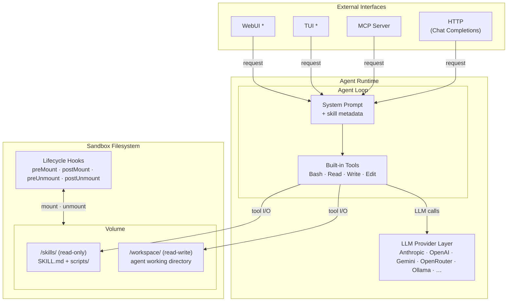

# Agent Bundle Proposal

> Bundle skills into a single deployable agent.

## Background

Since Anthropic open-sourced the Agent Skills standard in late 2025, skills have become the de facto unit of capability for coding agents. OpenAI and other major players have adopted the standard, and the industry consensus is shifting from writing code directly to building reusable skills that agents execute on behalf of users.

## Problem Statement

The Agent Skills widely used today do not yet map naturally to an online-service ecosystem. They work well inside local coding agents, but there is still no effective, standardized path to deploy them as online services.

This creates a structural gap and significant friction between local development and production environments:

1. Deployment limitations  
   Teams can share skills for local use, but consumers must manually install them in their own agent setups. These skills cannot be published and operated as first-class online services.
2. Organizational impact
   This friction is tolerable for individual users but scales poorly. All three major cloud vendors have launched initiatives to address this gap [3][4][5], and industry data shows only 5-14% of agentic AI projects successfully transition from pilot to production [1][2].
3. Technical debt and migration cost  
   To ship online, developers must rewrite logic and add deployment-specific validation. This creates high migration cost, inconsistency between offline and online behavior, and long-term maintenance burden.


## Proposed Solution

We propose a lightweight, self-contained agent runtime that loads a curated set of Agent Skills, executes them via a built-in agent loop, and exposes the result as a deployable service.

The runtime consists of the following core components:

1. Skill Manager
   Discovers, loads, and manages Agent Skills from local directories or remote registries. Each skill runs within a scoped permission boundary controlling filesystem, network, and execution access. Detailed permission model design is deferred to a later stage.
2. Built-in Agent Loop
   A lightweight loop that handles skill matching, tool calling, and structured output for each incoming request.
3. LLM Provider Layer
   Supports major providers natively (Anthropic, OpenAI, Gemini) and accepts third-party provider proxies such as LiteLLM and OpenRouter. For local development and personal use, it also supports Ollama, Codex OAuth, and Claude `setup-token` for accessing local or third-party compute.
4. Service Interface
   Exposes a minimal external API surface (an OpenAI-style Chat Completions endpoint and an MCP server) for external integration. Encapsulates internal mechanics including agent-loop orchestration, sandbox management, and filesystem setup.

The runtime is packaged into a Docker image via a YAML-driven configuration, producing a single deployable artifact ready for cloud or local use.

## What This Is Not

Agent Bundle is not a wrapper around existing agent tools such as Claude Code, Codex, or Cursor. It does not embed or adapt third-party agent loops. Instead, it provides its own lightweight runtime purpose-built for loading and serving Agent Skills as deployable services.

## Goals and Non-Goals

### Goals

1. Provide a YAML-driven tool that declares a bundle (skills, model, permissions) and produces a runnable agent in two modes:
   - `serve` — runs as a local process for development and testing
   - `build` — produces a Docker image for online deployment
2. Include a simple, basic built-in runtime in both modes:
   - a simple Agent Loop for request execution
   - a basic local sandbox service
3. Expose built-in service interfaces appropriate to each mode:
   - a minimal Chat Completions-compatible interface and an MCP server (available in both modes)
   - terminal/TUI and lightweight chat UI (local `serve` mode only)
4. Keep token and model-consumption strategy externally configurable by users.

### Non-Goals

1. Token and compute provisioning  
   We do not provide token budgets or LLM compute. Users must bring their own model access and related resources.
2. Persistence layer  
   The packaged runtime is fundamentally stateless and may be destroyed after use. Users are responsible for external persistence and for coordinating reloadable/re-entrant agent execution.
3. Skill security validation (current scope)  
   Users are responsible for ensuring packaged skills are valid and non-malicious. We may add baseline behavioral checks in the future, but that is outside the current core scope.
4. Cloud deployment orchestration
   We only produce a deployable image artifact and do not own downstream cloud deployment workflows.

## Future Work

The following items are intentionally excluded from the initial scope but may be explored in later iterations:

1. Pluggable Agent Loop engines
   The initial release ships a single built-in agent loop. Supporting pluggable or user-supplied loop implementations may be considered once the core runtime stabilizes.
2. Advanced sandbox integrations
   The initial release provides a basic built-in sandbox service. Docker-oriented sandboxing with fine-grained isolation may be added based on user demand.

## Design Overview

### Architecture



\* TUI and WebUI are available in local `serve` mode only.

### Sandbox Lifecycle

All hooks execute while the sandbox is alive and IO is available.

```
create ──► preMount ──► postMount ──► [agent session] ──► preUnmount ──► postUnmount ──► destroy
           (seed files)  (validate)                       (collect)      (upload/notify)
```

1. **create** — Sandbox infrastructure is provisioned (E2B sandbox started / K8s pod running). IO becomes available.
2. **preMount** — Seed session-specific files into the sandbox (e.g., user uploads, session config).
3. **postMount** — Validate setup, warm caches, run health checks. Sandbox is ready for the agent.
4. **[agent session]** — The agent loop runs. All tool calls are routed to the sandbox.
5. **preUnmount** — Agent session ends. Collect artifacts, flush logs, snapshot state.
6. **postUnmount** — Upload artifacts to external storage, notify external systems, clean up.
7. **destroy** — Sandbox infrastructure is torn down. All resources released.

### Sandbox Interface

The sandbox abstraction provides a provider-agnostic interface for tool execution and file operations. Two providers are supported in v1: **E2B** (managed cloud sandboxes) and **Kubernetes** (self-hosted via k3d or any K8s cluster). Both `serve` and `build` modes run through the sandbox to ensure behavioral consistency; `serve` defaults to a local Docker/k3d sandbox.

#### Configuration

Common fields (timeout, resources) are provider-agnostic. Provider-specific settings go under the provider key only when needed.

```yaml
sandbox:
  provider: e2b              # or: kubernetes
  timeout: 900               # seconds
  resources:
    cpu: 2
    memory: 512MB

  # Provider-specific (optional)
  e2b:
    template: my-custom-template

  # kubernetes:
  #   namespace: agent-sandbox
  #   nodeSelector:
  #     gpu: "true"

  serve:                     # override for serve mode (optional)
    provider: kubernetes     # defaults to local docker/k3d
```

#### Primitives

**build** (CLI only, offline)

Reads the bundle YAML, packages skills and base tools into a sandbox template or image. For E2B this produces and uploads a template; for Kubernetes this builds and pushes a Docker image. This is not exposed as a runtime API — users run `agent-bundle build` from the CLI.

**Sandbox object** (runtime)

Created in memory with configuration and lifecycle hooks. No real resources are allocated until `start()` is called. Hooks are registered as constructor parameters.

```typescript
interface SandboxHooks {
  preMount?: (io: SandboxIO) => Promise<void>;
  postMount?: (io: SandboxIO) => Promise<void>;
  preUnmount?: (io: SandboxIO) => Promise<void>;
  postUnmount?: (io: SandboxIO) => Promise<void>;
}

interface ExecResult {
  stdout: string;
  stderr: string;
  exitCode: number;
}

interface FileEntry {
  name: string;
  path: string;
  type: "file" | "directory";
}

interface SandboxIO {
  exec(command: string, opts?: {
    timeout?: number;
    cwd?: string;
  }): Promise<ExecResult>;
  file: {
    read(path: string): Promise<string>;
    write(path: string, content: string | Buffer): Promise<void>;
    list(path: string): Promise<FileEntry[]>;
    delete(path: string): Promise<void>;
  };
}

type SandboxStatus =
  | "idle"      // created in memory, not yet started
  | "starting"  // provisioning infrastructure + running hooks
  | "ready"     // agent can use the sandbox
  | "stopping"  // running shutdown hooks + destroying
  | "stopped";  // all resources released

interface Sandbox extends SandboxIO {
  readonly id: string;
  readonly status: SandboxStatus;

  start(): Promise<void>;     // create → preMount → postMount → ready
  shutdown(): Promise<void>;  // preUnmount → postUnmount → destroy
}
```

#### Design decisions

- **No path restrictions.** The sandbox is ephemeral (1:1 session model). Skills in `/skills/` are restored on every new session. The agent has full freedom within the sandbox; no write-protection is enforced on any path.
- **exec is synchronous.** `SandboxIO.exec()` waits for command completion and returns the full result. Streaming is a separate concern handled by the build monitor / observability layer for human consumption, not part of the sandbox primitives.
- **Hooks receive `SandboxIO`, not the full `Sandbox`.** This prevents hooks from accidentally calling `start()` or `shutdown()`. Hooks can use both `exec` and `file` operations without restriction.

#### Providers

| Provider | `start()` | `exec()` / `file.*` | `shutdown()` |
|---|---|---|---|
| **E2B** | `Sandbox.create(template)` | E2B SDK: `commands.run()`, `files.read/write()` | `sandbox.kill()` |
| **Kubernetes** | Create pod from image, wait for ready | execd HTTP endpoints: `/command/run`, `/files/*` | Delete pod |

### Agent-Loop Integration

The agent loop (pi-mono/coding-agent) runs on the **host**. Only tool execution happens inside the sandbox. The integration point is at pi-mono's **operations layer** — each tool delegates its low-level IO to the sandbox via pluggable operation interfaces.

```
Agent Loop (host)
  │
  ├── Read tool  ──► ReadOperations  ──► sandbox.file.read()
  ├── Write tool ──► WriteOperations ──► sandbox.file.write()
  ├── Edit tool  ──► ReadOperations + WriteOperations
  │                  (pi-mono handles fuzzy matching, BOM, line endings;
  │                   file IO delegates to sandbox)
  └── Bash tool  ──► BashOperations  ──► sandbox.exec()
                                              │
                                              ▼
                                     Sandbox (E2B or K8s pod)
```

This approach preserves pi-mono's full tool logic (Edit's fuzzy matching, output truncation, etc.) while routing all filesystem and process operations to the sandbox. Adding a new sandbox provider requires only implementing the `Sandbox` interface — no changes to the agent loop or tools.

## Implementation Plan

<!-- Break down the work into phases or milestones. -->

## Open Questions

<!-- List unresolved questions or areas needing further discussion. -->

## References

1. Cleanlab, "AI Agents in Production 2025: Enterprise Trends and Best Practices," https://cleanlab.ai/ai-agents-in-production-2025/
2. Deloitte, "Emerging Technology Trends 2025/2026" (agentic AI adoption data)
3. AWS DevOps Agent Team, "Graduating Prototypes into Products," January 2026
4. Microsoft Azure AI Foundry, "Agent Factory: From Local to Production," https://azure.microsoft.com/en-us/products/ai-foundry
5. Google Cloud, "Production-Ready AI Learning Path," November 2025
